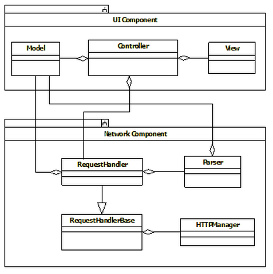
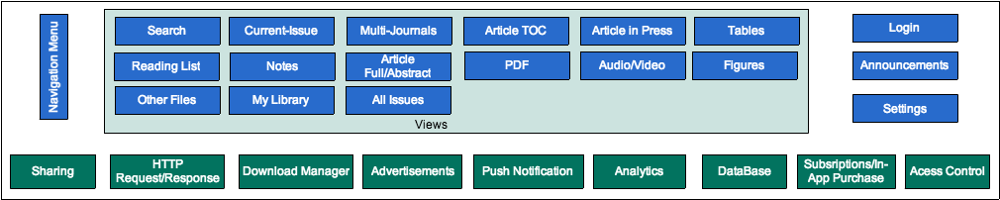
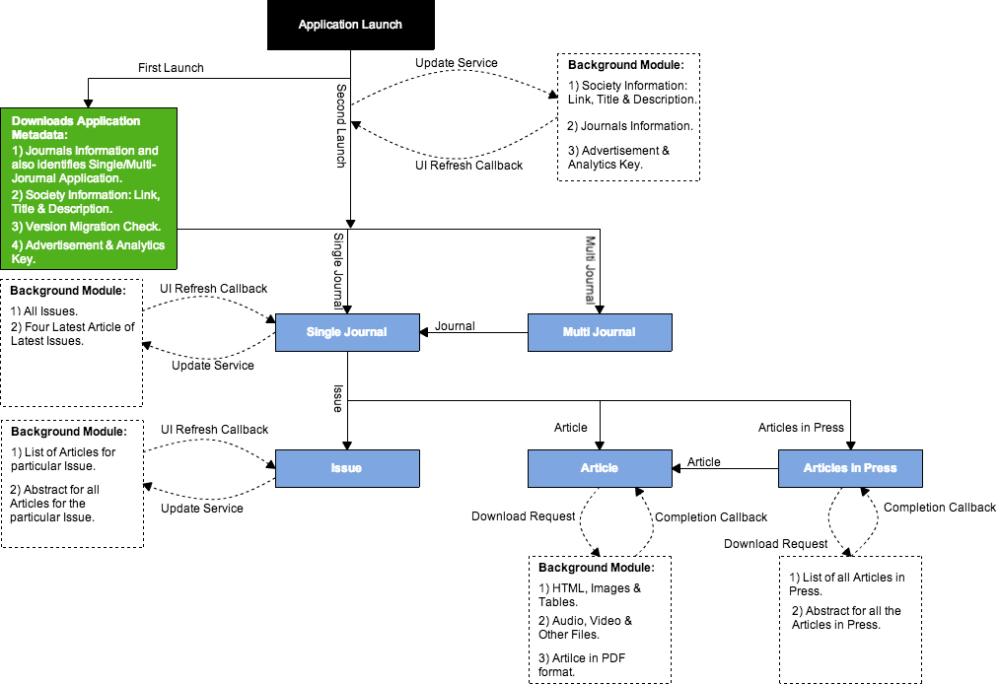
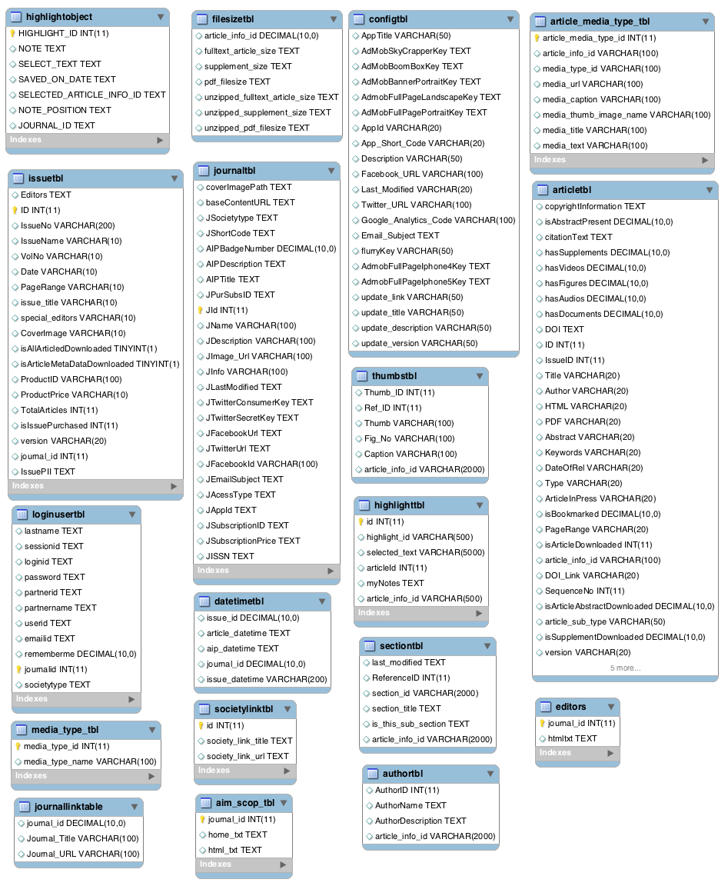

#JAT 4.5 Mobile Application Architecture Document

##1. Introduction

This document contains the Mobile Application Architecture for JAT project.

###1.1  Purpose of the Document
The purpose of this document is to: 

- Identify various design approaches.
- Identify core modules of the system.
- Identify data structures and algorithm.
- Identify and finalize UI design in terms of technical implementation.

###1.2 Scope of the Document
The scope is determined on following factors:

- Platform: iOS
- Mobile:
    - Base-SDK: 5.0 
    - Orientation: Portrait/ Landscape
    - Device: iPhone/ iPad
    - Languages: English
- Service-Response: JSON

###1.3 Goals and Guidelines
Primary goal of this design is to make a memory efficient and responsive native application. Hence effective memory management needs to be taken care during development. We also need to assure that we reuse the code as much as possible.  

##2. Application Architecture Framework
###2.1 Architecture        

##3. Application Component Description
###3.1 Network Component
This component will provide the functionality of Request Response handler, which will connect to a remote url and fetch data. It has been divided into three parts:

- `HttpManager`  
This class is responsible to send and fetch the data from server. This class  deals with UrlConnection to send/receive the data from server 
- `RequestHandlerBase`  
 This class is a base class of each RequestHandler class with respect to relative module.  It holds the common functionality of request handler and provides the service to `Request Handler` by inheritance. It conforms to the response returned by the HttpManager and sends it to its respective request handler.
- `Request Handler`  
It conforms to the response returned by RequestHandlerBase. This class creates the request and submits the created request. This class parses the response into data model and then notifies the controller towards the arrival of data. 

###3.2 UI Component
UI Component comprises of Model, View and Controller. This component is based on Model-View-Controller design pattern.
 
 - The model manages data of the application domain.
 - The view renders the model into a form suitable for interaction, typically a user interface element. Multiple views can exist for a single model for different purposes.
 - The controller receives user input and initiates a response by making calls on model objects. A controller accepts input from the user and instructs the model and view to perform actions based on that input.

##4. Application Modules
###4.1 Application Architecture
####4.1.1 Modules Stack

####4.1.2 Data Flow

###4.2 DB Schema

###4.3 Application Specific Modules

####4.3.1 Singleton Modules
#####4.3.1.1 _AppDelegate
This class is the Apple's default class loaded at the launch time of the application. The responsibilities handled by this class in JAT application are:

- It initializes the analytics libraries.
- It loads splash screen which calls the web-service to fetch the journal information.
- It registers for the push notifcations.
- It decides whether it is a Single/ Multi-Journal application and loads the corresponding view.

######4.4.3.1.1.1 APPDelegateMethodsHandler
This class is accessed as a singleton class through **_AppDelegate** class. It performs most of the mazor application functionalities:

- It copies the PDF files, abstracts, other data into seperate folders in the application documents directory.
- It checks for the application version number and performs the migration if needed.
- It checks for database connectivity.

#####4.3.1.2 DatabaseConnect
This will be a singleton class responsible for insertion/deletion/updation on database table. It will also be responsible for opening/closing the database connection.

#####4.3.1.3 ServerHandler
This will be a singleton class responsible for making and sending requests to server for downloading content. 

####4.3.2 Constants Modules
#####4.3.2.1 Global
This class will contain all the constant values, enums i.e. anything which will not be changing and is used across the application such as height, macros, constant strings, etc.
#####4.3.2.2 WebConstant
This class will be responsible for storing the application related constants such as App-ID, App-Version, URL's, Keys, etc.

####4.3.3 Controller Modules

#####4.3.3.1 NavBarTopRightView
This class is custom view inheriting from UIView for displaying the top-bar which contains information, search, & settings button. Their are seperate custom controller classes implemented for loading the corresponding views on button events.

#####4.3.3.2 MultiJournalViewController
This class is responsible for displaying all the Journals. It  includes society description, facebook-link, twitter-link, society banner image, etc. It uses two further views for the implementation:

######4.3.3.2.1 MultiJournalScrollListView
This class is custom view inheriting from UIView for displaying particular Journal in scroll view on a  multijournal page.

######4.3.3.2.2 SocietyView
This class is custom view inheriting from UIView for displaying the society information. It also links the society Facebook & Twitter page.

#####4.3.3.3 SingleJournalViewController (KTSlideController) 
This class is responsible for displaying the single journal information. It consist of two sub view-controllers for displaying the left & right panel.The two sub view-controllers are:

######4.3.3.3.1 HomeScreenMenuViewController
This class is responsible for displaying the left-panel.It uses list-view to display all the options to the user such as My-Articles, Journal-Info, etc.

######4.3.3.3.2 LatestArticleViewController 
This class is responsible for displaying the right-panel which contains issue and its articles information. It uses two sub view-controllers for the implementation:

1. *ArticleTableView:* This classes used native list-view and is responsible for displaying all the articles for the current issue.
2. *TopViewForArticleViewController:* This classes is responsible for displaying the latest issue cover image and its details.

#####4.3.3.4 ArticleSearchController
This class is responsible for searching the keywords in contents of issues & articles. It uses *ArticleTableView* to display the search results.  

#####4.3.3.5 ReadingListViewController
This class is responsible for displaying all Bookmarked articles. It also uses *ArticleTableView* for displaying the bookmarked articles.

#####4.3.3.6 FullTextViewController (KTSlideController)
This class is responsible for displaying all the information related to the Article. It consist of two sub view-controllers for displaying the left & right panel.The two  sub view-controllers are:

######4.3.3.6.1 ArticleMenuViewController 
This class is responsible for displaying the left menu options related to an article such as citation, audio, video, figures, tables, other files, notes etc.

######4.3.3.6.2 WebViewController
This class is responsible for displaying Abstarct, Full-text and PDF of an Article. This class also maintains downloading of full text and pdf of an article. It also manages the sharing information of artical on Facebook & Twitter. 

#####4.3.3.7 ArticleViewController_iPad
This class is responsible for displaying all the Articles for the particular Issue. It uses native list-view for displaying all the Articles.

#####4.3.3.8 ArticleInPressViewController_iPad
This class is responsible for displaying all the Articles in press for the particular Journal. It uses native list-view for displaying all the Articles.

#####4.3.3.9 AllIssueListViewController
This class is responsible for displaying all the Issues. This class also differentiate in all Issues available and the issues present on the user's device. The user can select amongst any of the two options.

#####4.3.3.10 DownloadShareManager
This class will be singleton class responsible for downloading all the content in the application.

#####4.3.3.11 ArticleAccessControl
This class will be responsible for checking whether the user can access the particular article or not depending on the article access type, login-session or purchase history.

##5. Application Model Classes
###5.1 MultiJournalInfo
<table>
<tr><td><b>Name<b></td><td><b>Property(P)<b></td><td><b>Details<b></td></tr>
<tr><td>App_ID</td><td>P</td><td>Stores the application-ID.</td></tr>
<tr><td>App_Short_Code</td><td>P </td><td>Stores the application code.</td></tr>
<tr><td>App_Title</td><td>P </td><td>Stores the application title.</td></tr>
<tr><td>Society_Description</td><td>P </td><td>Stores the society description.</td></tr>
<tr><td>Society_Facebook_URL</td><td>P</td><td>Stores the facebook URL.</td></tr>
<tr><td>Society_Twitter_URL</td><td>P </td><td>Stores the twitter URL.</td></tr>
<tr><td>Dart_ID</td><td>P </td><td>Stores the Dart-ID.</td></tr>
<tr><td>Flurry_ID</td><td>P </td><td>Stores the Flurry-ID.</td></tr>
<tr><td>Google_Analytics_Code</td><td>P</td><td>Stores the GoogleAnalytics-ID.</td></tr>
<tr><td>Last_Modified</td><td>P </td><td>Stores the last modified time.</td></tr>
<tr><td>journalArray</td><td>P </td><td>Stores the array of JournalInfo objects.</td></tr>
<tr><td>SocietyArray</td><td>P </td><td>Stores the array of SocietyLinkInfo objects.</td></tr>
<tr><td>updatedLink</td><td>P </td><td>Stores the update link.</td></tr>
<tr><td>updatedVersion</td><td>P </td><td>Stores the update version.</td></tr>
<tr><td>updatedTitle</td><td>P</td><td>Stores the update title.</td></tr>
<tr><td>updatedDescription</td><td>P </td><td>Stores the update description.</td></tr>
<tr><td>issueInfo</td><td>P </td><td>Stores the issue information.</td></tr>
<tr><td>isSocietyInfoAvailable</td><td>P </td><td>Stores whether the society is available.</td></tr>

<tr><td>AppBannerPortraitSplashScreenAdIPhone</td><td>P</td><td>Stores the AdMob Spash Screen for IPhone.</td></tr>
<tr><td>AppBannerPortraitSplashScreenAdIpad</td><td>P </td><td>Stores the AdMob Spash Screen for IPad.</td></tr>
<tr><td>MJFullPageLandscapeAdIpad</td><td>P </td><td>Stores the multijournal AdMob full page landscape key in case of Search.</td></tr>
<tr><td>MJFullPagePortraitAdIpad</td><td>P </td><td>Stores the multijournal AdMob full page portrait key in case of search.</td></tr>
<tr><td>MJFullPagePortraitAdIphone5</td><td>P </td><td>Stores the multijournal AdMob full page portrait key for Iphone 5.This key will be used in case of search.</td></tr>
<tr><td>MjFullPagePortraitAdIphone4</td><td>P </td><td>Stores the multijournal AdMob full page portrait key for Iphone 4.This key will be used in case of search</td></tr>
<tr><td>MJBannerPortraitAdIpad</td><td>P </td><td>Stores the multijournal AdMob banner portrait key for Ipad.</td></tr>
<tr><td>MjBannerPortraitAdIphone</td><td>P </td><td>Stores the multijournal AdMob banner portrait key for Iphone.</td></tr>
</table>

###5.2 SocietyLinkInfo
<table>
<tr><td><b>Name<b></td><td><b>Property(P)<b></td><td><b>Details<b></td></tr>
<tr><td>societyId</td><td>P </td><td>Stores the society-ID.</td></tr>
<tr><td>society_link_title</td><td>P </td><td>Stores the society title.</td></tr>
<tr><td>society_link_url</td><td>P </td><td>Stores the society URL.</td></tr>
</table>

###5.3 JournalInfo
<table>
<tr><td><b>Name<b></td><td><b>Property(P)<b></td><td><b>Details<b></td></tr>
<tr><td>Journal_Id </td><td>P</td><td>Stores the journal-ID.</td></tr>
<tr><td>ISSN </td><td>P</td><td>Stores the journal ISSN number.</td></tr>
<tr><td>Journal_Title</td><td>P </td><td>Stores the journal title.</td></tr>
<tr><td>Journal_Image_URL</td><td>P </td><td>Stores the journal image URL.</td></tr>
<tr><td>Journal_Facebook_URL</td><td>P</td><td>Stores the facebook URL.</td></tr>
<tr><td>Journal_Twitter_URL</td><td>P </td><td>Stores the twitter URL.</td></tr>
<tr><td>Facebook_ID </td><td>P</td><td>Stores the Dart-ID.</td></tr>
<tr><td>Twitter_kOAuthConsumerSecret</td><td>P </td><td>Stores the twitter secret key.</td></tr>
<tr><td>Twitter_kOAuthConsumerKey</td><td>P</td><td>SStores the twitter consumer key.</td></tr>
<tr><td>Subscription_ID</td><td>P </td><td>Stores the subscription-ID.</td></tr>
<tr><td>Subscription_Price</td><td>P </td><td>Stores the subscription price.</td></tr>
<tr><td>Last_Modified</td><td>P </td><td>Stores the last modified time.</td></tr>
<tr><td>journalLinks</td><td>P</td><td>Stores the list of journal links.</td></tr>
<tr><td>jAppShortCode</td><td>P </td><td>Stores the short code.</td></tr>
<tr><td>AccessType</td><td>P </td><td>Stores the access type.</td></tr>
<tr><td>EmailSubject</td><td>P </td><td>Stores the email subject.</td></tr>
<tr><td>AIPTitle</td><td>P </td><td>Stores the AIP title.</td></tr>
<tr><td>AIPDescription</td><td>P </td><td>Stores the AIP description.</td></tr>
<tr><td>societyType</td><td>P </td><td>Defines the Society type.</td></tr>
<tr><td>isAIPAvailable</td><td>P</td><td>Defines the AIP availability.</td></tr>
<tr><td>isAimAndScopeAvailable</td><td>P </td><td>Defines the aim and scope availability.</td></tr>
<tr><td>isEditotrsAndBoardAvailable</td><td>P </td><td>Defines the editor and boards availability.</td></tr>
<tr><td>baseContentURL</td><td>P </td><td>Stores the base content URL.</td></tr>
<tr><td>coverImagePath</td><td>P </td><td>Stores the cover path image URL.</td></tr>
<tr><td>isIssueCoverImageAvailable</td><td>P </td><td>Defines the issue cover image availability.</td></tr>
<tr><td>sequence</td><td>P </td><td>Stores the sequence number of journal for multijournal screen.</td></tr>
<tr><td>FullPageLandscapeAdIpad</td><td>P </td><td>Stores the journal level AdMob full page landscape ad for Ipad.</td></tr>
<tr><td>FullPagePortraitAdIpad</td><td>P </td><td>Stores the journal level AdMob full page portrait ad for Ipad.</td></tr>
<tr><td>FullPagePortraitAdIphone5</td><td>P </td><td>Stores the journal level AdMob full page portrait ad for Iphone 5.</td></tr>
<tr><td>FullPagePortraitAdIphone4</td><td>P </td><td>Stores the journal level AdMob full page portrait ad for Iphone 4.</td></tr>
<tr><td>SkyCrapperPortraitAdIpad</td><td>P </td><td>Stores the journal level AdMob banner skyscrapper key for Ipad.</td></tr>
<tr><td>BannerPortraitAdIpad</td><td>P </td><td>Stores the journal level AdMob banner portrait key for Ipad.</td></tr>
<tr><td>BannerPortraitAdIPhone</td><td>P </td><td>Stores the journal level AdMob banner portrait key for Iphone.</td></tr>

</table>

###5.4 IssueInfo
<table>
<tr><td><b>Name<b></td><td><b>Property(P)<b></td><td><b>Details<b></td></tr>
<tr><td>journalId </td><td>P</td><td>Stores the journal-ID.</td></tr>
<tr><td>issue_id </td><td>P</td><td>Stores the issue-ID.</td></tr>
<tr><td>issue_number</td><td>P </td><td>Stores the issue number.</td></tr>
<tr><td>volume</td><td>P </td><td>Stores the volume number.</td></tr>
<tr><td>editors</td><td>P</td><td>Stores the editors information.</td></tr>
<tr><td>date_Of_Release</td><td>P </td><td>Stores the date of release.</td></tr>
<tr><td>page_Range </td><td>P</td><td>Stores the page range.</td></tr>
<tr><td>last_Modified</td><td>P </td><td>Stores the last modified time.</td></tr>
<tr><td>issue_Title</td><td>P</td><td>Stores the issue title..</td></tr>
<tr><td>special_Editors</td><td>P </td><td>Stores the special editors information.</td></tr>
<tr><td>special_Issue</td><td>P </td><td>Stores the special issue.</td></tr>
<tr><td>video</td><td>P </td><td>Stores the video link.</td></tr>
<tr><td>cover_Image</td><td>P</td><td>Stores the cover image link.</td></tr>
<tr><td>product_ID</td><td>P </td><td>Stores the product-ID.</td></tr>
<tr><td>price</td><td>P </td><td>Stores the price.</td></tr>
<tr><td>issuePII</td><td>P </td><td>Stores the issue PII number.</td></tr>
<tr><td>totalArticles</td><td>P </td><td>Stores the articles.</td></tr>
</table>

###5.5 DownloadArticleInfo
<table>
<tr><td><b>Name<b></td><td><b>Property(P)<b></td><td><b>Details<b></td></tr>
<tr><td>article_id </td><td>P</td><td>Stores the article-ID.</td></tr>
<tr><td>issue_id </td><td>P</td><td>Stores the issue-ID.</td></tr>
<tr><td>journal_id</td><td>P </td><td>Stores the journal-ID.</td></tr>
<tr><td>article_title</td><td>P </td><td>Stores the article title.</td></tr>
<tr><td>articleinPress</td><td>P</td><td>Stores the article in press.</td></tr>
<tr><td>hasDocuments</td><td>P </td><td>Defines whether the article has document.</td></tr>
<tr><td>hasAudios </td><td>P</td><td>Defines whether the article has audio.</td></tr>
<tr><td>hasFigures</td><td>P </td><td>Defines whether the article has figures.</td></tr>
<tr><td>hasVideos</td><td>P</td><td>Defines whether the article has videos.</td></tr>
<tr><td>isSupplementDownloaded</td><td>P </td><td>Defines whether the article supplement is downloaded.</td></tr>
<tr><td>hasSupplements</td><td>P </td><td>Defines whether the article has supplement.</td></tr>
<tr><td>isCMEArticle</td><td>P </td><td>Defines whether the article contains CME Article.</td></tr>
<tr><td>isBookmarked</td><td>P</td><td>Defines whether the article is bookmarked.</td></tr>
<tr><td>isArticleAbstractDownloaded</td><td>P </td><td>Defines whether the article abstarct is downloaded.</td></tr>
<tr><td>isArticlePurchased</td><td>P </td><td>Defines whether the article is purchased.</td></tr>
<tr><td>isArticleDownloaded</td><td>P </td><td>Defines whether the article is downloaded.</td></tr>
<tr><td>isAuthorExpanded</td><td>P </td><td>Defines whether the author is expanded.</td></tr>
<tr><td>isAbstractPresent</td><td>P </td><td>Defines whether the article abstract is present.</td></tr>
</table>

###5.6 ArticleInfo
<table>
<tr><td><b>Name<b></td><td><b>Property(P)<b></td><td><b>Details<b></td></tr>
<tr><td>html_file_name </td><td>P</td><td>Stores the HTML file name.</td></tr>
<tr><td>pdf_file_name </td><td>P</td><td>Stores the PDF file name.</td></tr>
<tr><td>abstract</td><td>P </td><td>Stores the abstract.</td></tr>
<tr><td>keywords</td><td>P </td><td>Stores the keywords.</td></tr>
<tr><td>releaseDate</td><td>P</td><td>Stores the release date.</td></tr>
<tr><td>author</td><td>P </td><td>Stores the author.</td></tr>
<tr><td>type </td><td>P</td><td>Stores the article type.</td></tr>
<tr><td>articleSubType</td><td>P </td><td>Stores the article sub type.</td></tr>
<tr><td>DOI</td><td>P</td><td>Stores the date of issue.</td></tr>
<tr><td>DOI_Link</td><td>P </td><td> Stores DOI link.</td></tr>
<tr><td>myNotes</td><td>P </td><td>Stores the notes.</td></tr>
<tr><td>notesSelectedText</td><td>P </td><td>Stores the notes selected text.</td></tr>
<tr><td>year</td><td>P</td><td>Stores the year.</td></tr>
<tr><td>bookmarkCreatedDate</td><td>P </td><td>Stores the bookmark created date.</td></tr>
<tr><td>journalName</td><td>P </td><td>Stores the journal name.</td></tr>
<tr><td>copyrightInformation</td><td>P </td><td>Stores the copyright information.</td></tr>
<tr><td>issuePII</td><td>P </td><td>Stores the issue PII number.</td></tr>
<tr><td>authorArray</td><td>P </td><td>Stores the array of AuthorsData.</td></tr>
<tr><td>citationText</td><td>P </td><td>Stores the citation text.</td></tr>
<tr><td>sequenceNo</td><td>P </td><td>Stores the sequence number.</td></tr>
<tr><td>objFileSizeInfo</td><td>P </td><td>Stores the FileSizeInfo object.</td></tr>
</table>

###5.7 AuthorsData
<table>
<tr><td><b>Name<b></td><td><b>Property(P)<b></td><td><b>Details<b></td></tr>
<tr><td>authorId </td><td>P</td><td>Stores the authors-ID.</td></tr>
<tr><td>articleId </td><td>P</td><td>Stores the article-ID.</td></tr>
<tr><td>authorName</td><td>P </td><td>Stores the  author name.</td></tr>
<tr><td>authorDescription</td><td>P </td><td>Stores the author description.</td></tr>
<tr><td>articleInfoId</td><td>P</td><td>Stores the articleinfo-ID.</td></tr>
</table>

###5.8 LoginUserInfo
<table>
<tr><td><b>Name<b></td><td><b>Property(P)<b></td><td><b>Details<b></td></tr>
<tr><td>userID </td><td>P</td><td>Stores the user-ID.</td></tr>
<tr><td>login </td><td>P</td><td>Stores the login type.</td></tr>
<tr><td>session</td><td>P </td><td>Stores the login session.</td></tr>
<tr><td>firstName</td><td>P </td><td>Stores the first name.</td></tr>
<tr><td>lastName</td><td>P</td><td>Stores the last name.</td></tr>
<tr><td>email</td><td>P </td><td>Stores the email.</td></tr>
<tr><td>errorMessage </td><td>P</td><td>Stores the error message.</td></tr>
<tr><td>errorCode</td><td>P </td><td>Stores the error code.</td></tr>
</table>

###5.9 SocietyLoginInfo
<table>
<tr><td><b>Name<b></td><td><b>Property(P)<b></td><td><b>Details<b></td></tr>
<tr><td>partnerId </td><td>P</td><td>Stores the patner-ID.</td></tr>
<tr><td>partnerName </td><td>P</td><td>Stores the patner Name.</td></tr>
<tr><td>forgotPwdService</td><td>P </td><td>Stores the forgot password service.</td></tr>
<tr><td>forgotPwdURL</td><td>P </td><td>Stores the forgot password URL.</td></tr>
<tr><td>helptext</td><td>P</td><td>Stores the help text.</td></tr>
<tr><td>acronym</td><td>P </td><td>Stores the acronym.</td></tr>
<tr><td>errorMessage </td><td>P</td><td>Stores the error message.</td></tr>
<tr><td>errorCode</td><td>P </td><td>Stores the error code.</td></tr>
</table>

###5.10 JournalLinkData
<table>
<tr><td><b>Name<b></td><td><b>Property(P)<b></td><td><b>Details<b></td></tr>
<tr><td>linkID </td><td>P</td><td>Stores the link-ID.</td></tr>
<tr><td>linkTitle </td><td>P</td><td>Stores the link title.</td></tr>
<tr><td>_inkURL</td><td>P </td><td>Stores the link URL.</td></tr>
</table>

###5.11 ArticleSectionInfo
<table>
<tr><td><b>Name<b></td><td><b>Property(P)<b></td><td><b>Details<b></td></tr>
<tr><td>sectionTitle </td><td>P</td><td>Stores the section title.</td></tr>
<tr><td>isExpanded </td><td>P</td><td>Defines whether the section in expanded.</td></tr>
<tr><td>indexNumber</td><td>P </td><td>Stores the index number.</td></tr>
</table>

###5.12 ArticleAndIssuesInfo
<table>
<tr><td><b>Name<b></td><td><b>Property(P)<b></td><td><b>Details<b></td></tr>
<tr><td>articleInfoObj </td><td>P</td><td>Stores the ArticleInfo object.</td></tr>
<tr><td>issueInfoObj </td><td>P</td><td>Stores the IssueInfo object.</td></tr>
<tr><td>isChecked</td><td>P </td><td>Defines whether it is checked.</td></tr>
</table>

###5.13 NotesInfo
<table>
<tr><td><b>Name<b></td><td><b>Property(P)<b></td><td><b>Details<b></td></tr>
<tr><td>articleAndIssuesInfo </td><td>P</td><td>Stores the ArticleAndIssuesInfo object.</td></tr>
<tr><td>highlightObject </td><td>P</td><td>Stores the HighlightObject object.</td></tr>
</table>

###5.14 ArticleMediaInfo
<table>
<tr><td><b>Name<b></td><td><b>Property(P)<b></td><td><b>Details<b></td></tr>
<tr><td>articleInfoId </td><td>P</td><td>Stores the articleInfo-ID.</td></tr>
<tr><td>mediaTypeId </td><td>P</td><td>Stores the mediaType-ID.</td></tr>
<tr><td>mediaUrl</td><td>P </td><td>Stores the media path URL.</td></tr>
<tr><td>mediaCompleteLocalUrl</td><td>P </td><td>Stores the media complete path URL.</td></tr>
<tr><td>mediaCaption</td><td>P</td><td>Stores the media caption.</td></tr>
<tr><td>mediaThumbImageName</td><td>P </td><td>Stores the media thumb image name.</td></tr>
<tr><td>articleAuthor </td><td>P</td><td>Stores the article author.</td></tr>
<tr><td>articleSubType</td><td>P </td><td>Stores the article sub type.</td></tr>
<tr><td>mediaTitle</td><td>P</td><td>Stores the media title.</td></tr>
<tr><td>articleTitle</td><td>P </td><td>Stores the article title</td></tr>
<tr><td>isAuthorExpanded</td><td>P </td><td>Defines whether author is expanded.</td></tr>
</table>

###5.15 OlderIssueObjects
<table>
<tr><td><b>Name<b></td><td><b>Property(P)<b></td><td><b>Details<b></td></tr>
<tr><td>issueId </td><td>P</td><td>Stores the issue-ID.</td></tr>
<tr><td>issueNo </td><td>P</td><td>Stores the issue number.</td></tr>
<tr><td>editors</td><td>P </td><td>Stores the editors.</td></tr>
<tr><td>issueName</td><td>P </td><td>Stores the issue name.</td></tr>
<tr><td>volNo</td><td>P</td><td>Stores the volume number.</td></tr>
<tr><td>date</td><td>P </td><td>Stores the issue date.</td></tr>
<tr><td>pageRange </td><td>P</td><td>Stores the page range.</td></tr>
<tr><td>specialIssueTitle</td><td>P </td><td>Stores the special issue title.</td></tr>
<tr><td>specialIssueEditorNames</td><td>P</td><td>Stores the special issue editors names.</td></tr>
<tr><td>coverImage</td><td>P </td><td>Stores the cover image.</td></tr>
<tr><td>productID</td><td>P </td><td>Stores the product-ID.</td></tr>
<tr><td>productPrice</td><td>P </td><td>Stores the product price.</td></tr>
<tr><td>isAllArticlesDownloaded</td><td>P</td><td>Defines whether all articles are downloaded.</td></tr>
<tr><td>isArticleMetadataDownloded</td><td>P </td><td>Defines whether article metadata is downloaded.</td></tr>
<tr><td>isIssuePurchased</td><td>P </td><td>Defines whether issue is purchased.</td></tr>
<tr><td>totalArticles</td><td>P </td><td>Stores the total number of articles.</td></tr>
<tr><td>version</td><td>P </td><td>Stores the version number.</td></tr>
</table>

###5.16 OlderArticleData
<table>
<tr><td><b>Name<b></td><td><b>Property(P)<b></td><td><b>Details<b></td></tr>
<tr><td>articleID </td><td>P</td><td>Stores the article-ID.</td></tr>
<tr><td>issueId </td><td>P</td><td>Stores the issue-ID.</td></tr>
<tr><td>title</td><td>P </td><td>Stores the article title.</td></tr>
<tr><td>author</td><td>P </td><td>Stores the author name.</td></tr>
<tr><td>HTML</td><td>P</td><td>Stores the HTML file name.</td></tr>
<tr><td>pdf</td><td>P </td><td>Stores the pdf file name.</td></tr>
<tr><td>abstract1 </td><td>P</td><td>Stores the abstract.</td></tr>
<tr><td>keyword</td><td>P </td><td>Stores the keywords.</td></tr>
<tr><td>releaseDate</td><td>P</td><td>Stores the release date.</td></tr>
<tr><td>articleSubType</td><td>P </td><td>Stores the article sub type.</td></tr>
<tr><td>articleinPress</td><td>P </td><td>Stores the article in press.</td></tr>
<tr><td>pageRange</td><td>P </td><td>Stores the page range.</td></tr>
<tr><td>articleInfoId</td><td>P</td><td>Stores the articleinfo-ID.</td></tr>
<tr><td>DOI_Link</td><td>P </td><td>Stores the DOI link.</td></tr>
<tr><td>myNotes</td><td>P </td><td>Stores my notes.</td></tr>
<tr><td>notesSelectedText</td><td>P </td><td>Stores the notes selected text.</td></tr>
<tr><td>isArticlePurchased</td><td>P </td><td>Defines whether articles is purchased.</td></tr>
<tr><td>isBookmarked</td><td>P </td><td>Defines whether article is bookmarked.</td></tr>
<tr><td>isArticleAbstractDownloaded</td><td>P </td><td>Defines whether article abstract is downloaded.</td></tr>
<tr><td>isPDFDownloaded</td><td>P </td><td>Defines whether PDF is downloaded.</td></tr>
<tr><td>version</td><td>P </td><td>Stores the version number.</td></tr>
<tr><td>authorArray</td><td>P </td><td>Stores the list of authors.</td></tr>
<tr><td>isArticalPurchasedViaInApp</td><td>P </td><td>Defines whether article is purchased through In-App purchase.</td></tr>
<tr><td>articleHeight</td><td>P </td><td>Stores the article height in portrait.</td></tr>
<tr><td>articalHeightLandscape</td><td>P </td><td>Stores the article height in landscape.</td></tr>
</table>

###5.17 ArticleSectionObject
<table>
<tr><td><b>Name<b></td><td><b>Property(P)<b></td><td><b>Details<b></td></tr>
<tr><td>sectionTitle </td><td>P</td><td>Stores the section title.</td></tr>
<tr><td>sectionTag </td><td>P</td><td>Stores the section tag.</td></tr>
<tr><td>articleInfoId</td><td>P </td><td>Stores the articleinfo-ID.</td></tr>
</table>

###5.18 SaveSearchResultInfo
<table>
<tr><td><b>Name<b></td><td><b>Property(P)<b></td><td><b>Details<b></td></tr>
<tr><td>journalID </td><td>P</td><td>Stores the journal-ID.</td></tr>
<tr><td>selectedOptionNumber </td><td>P</td><td>Stores the selected option for search.</td></tr>
<tr><td>issueID</td><td>P </td><td>Stores the issue-ID.</td></tr>
<tr><td>searchKeyword</td><td>P </td><td>Stores the search keyword.</td></tr>
<tr><td>lastResultCount</td><td>P</td><td>Stores the last results count.</td></tr>
<tr><td>selectedRow</td><td>P </td><td>Stores the  selected row.</td></tr>
</table>

###5.19 FileSizeInfo
<table>
<tr><td><b>Name<b></td><td><b>Property(P)<b></td><td><b>Details<b></td></tr>
<tr><td>pdfFileSize </td><td>P</td><td>Stores the PDF file size.</td></tr>
<tr><td>fulltextFileSize </td><td>P</td><td>Stores the full text size.</td></tr>
<tr><td>supplementFileSize</td><td>P </td><td>Stores the supplement file size.</td></tr>
<tr><td>unzippedPdfFileSize</td><td>P </td><td>Stores the unzipped PDF file size.</td></tr>
<tr><td>unzippedFulltextFileSize</td><td>P</td><td>Stores the unzipped full text file size.</td></tr>
<tr><td>unzippedSupplementFileSize</td><td>P </td><td>Stores the unzipped supplement file size.</td></tr>
<tr><td>articleInfoId </td><td>P</td><td>Stores the articleInfo-ID.</td></tr>
</table>

###5.20 HighlightObject
<table>
<tr><td><b>Name<b></td><td><b>Property(P)<b></td><td><b>Details<b></td></tr>
<tr><td>id </td><td>P</td><td>Stores the ID.</td></tr>
<tr><td>articleId </td><td>P</td><td>Stores the article-ID.</td></tr>
<tr><td>journalId</td><td>P </td><td>Stores the journal-ID.</td></tr>
<tr><td>highlightId</td><td>P </td><td>Stores the highlight-ID.</td></tr>
<tr><td>note</td><td>P</td><td>Stores the note.</td></tr>
<tr><td>selectedText</td><td>P </td><td>Stores the selected text.</td></tr>
<tr><td>savedOnDate </td><td>P</td><td>Stores the save date.</td></tr>
<tr><td>selectedArticleInfoID</td><td>P </td><td>Stores the articleInfo-ID.</td></tr>
<tr><td>notePosition </td><td>P</td><td>Stores the note position.</td></tr>
</table>