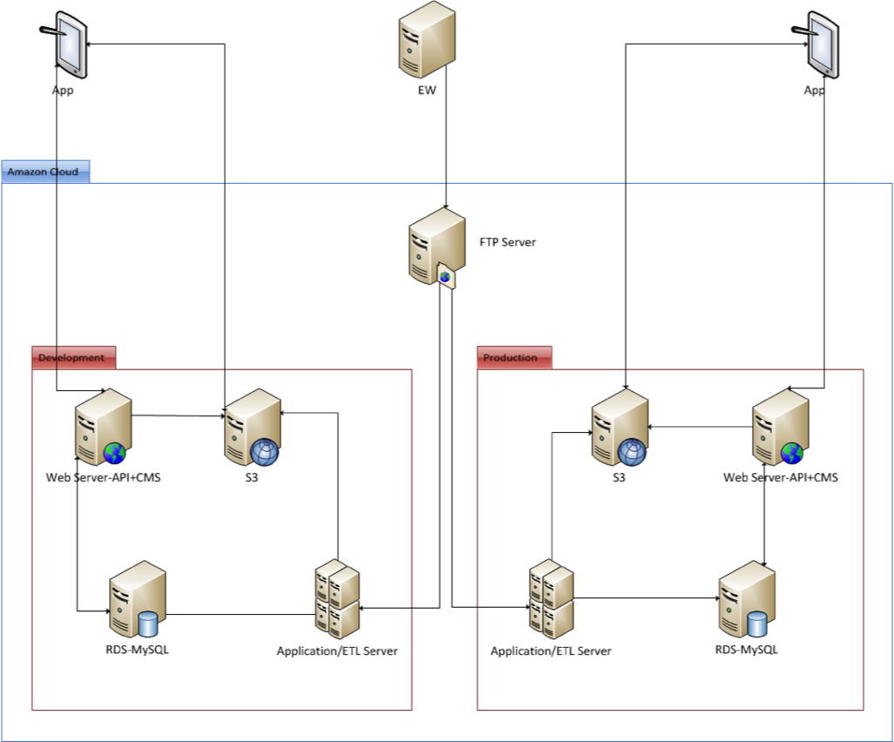
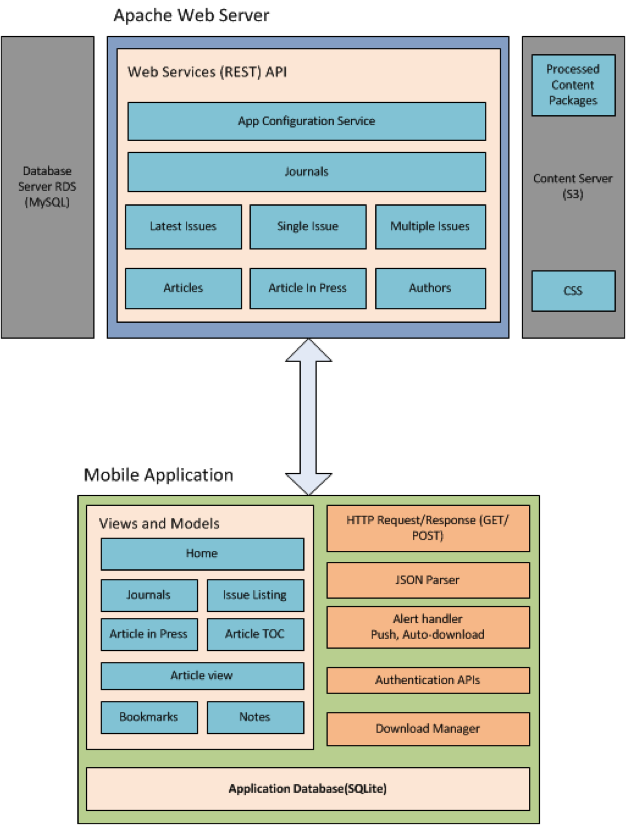
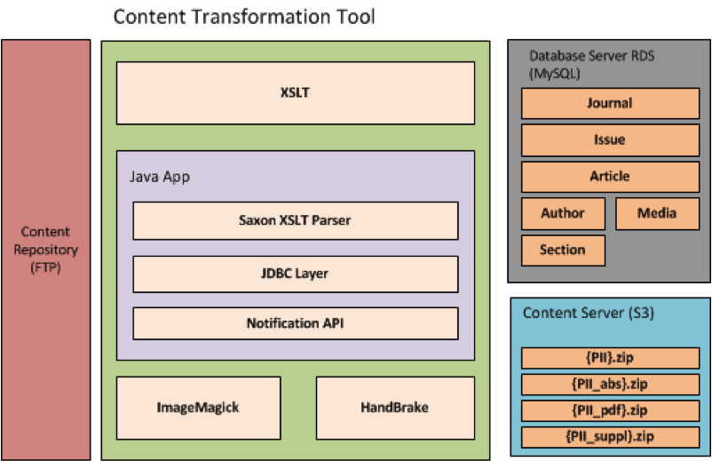
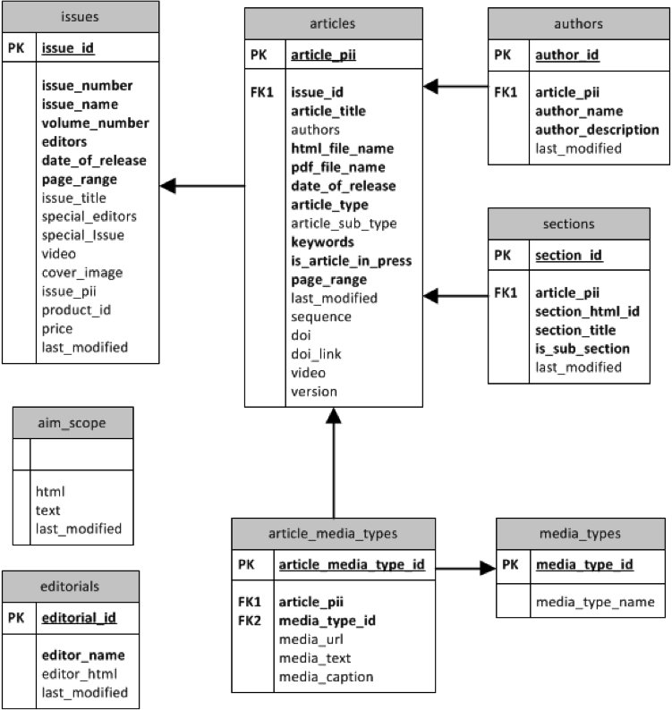
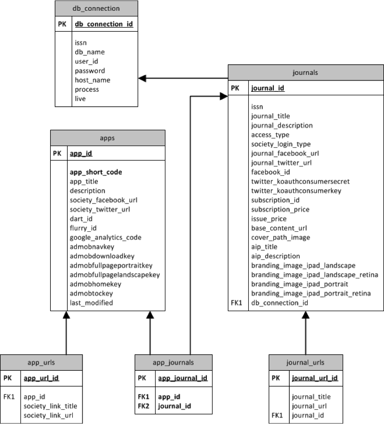
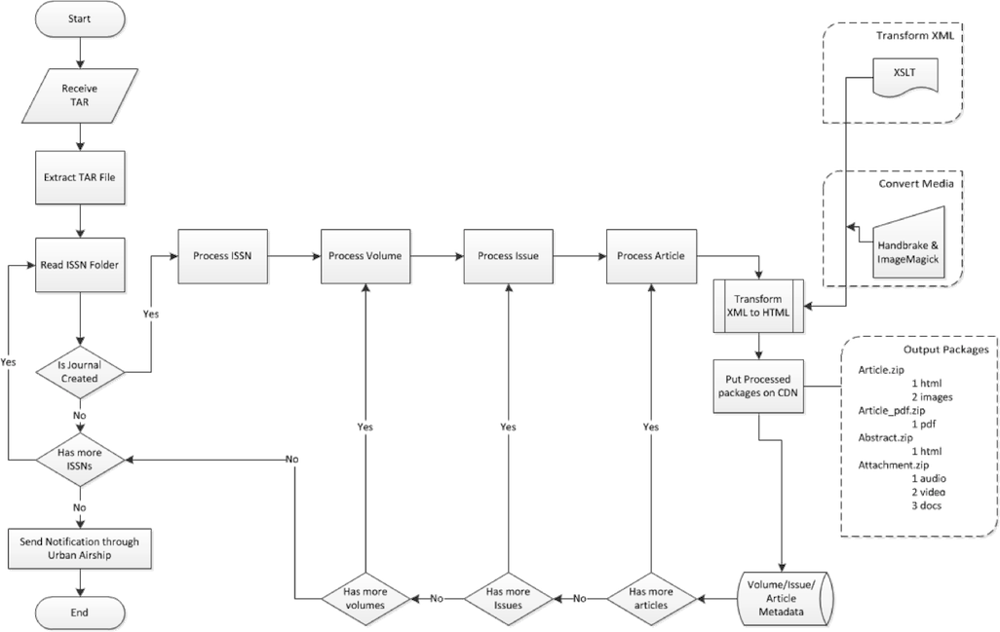
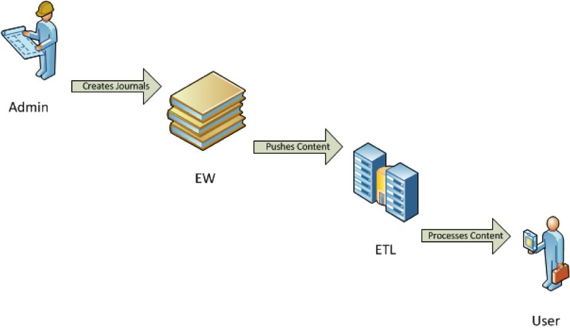

#JAT 4.5 WEB Architecture Document

##1. Introduction

This document contains the Web Architecture for JAT project.

###1.1  Purpose of the Document
The purpose of this document is to: 

- Identify various design approaches.
- Identify core modules of the system.

###1.2 Server Configuration
Server configuration and software versions required:

- OS: Linux (Red Hat Enterprise Linux 6.4)
- Web Server: Apache 2.2
- Database: MySQL 5+
- Scripting: PHP 5+
- JAVA: 1.6
- ImageMagick: 6+
- HandBrake: 0.9.8

###1.3 Goals and Guidelines
Primary goal of this design is to make a efficient & a scalable Web Architecture.

##2. Web Architecture
###2.1 Server Architecture        

###2.2 System Architecture         

###2.3 Content Architecture        

##3. Database Designs
###3.1 Content Database Model Design        

###3.2 Config Database Model Design        

##4. Flowchart
###4.1 Content Processing       

##5. System Process Flow        

